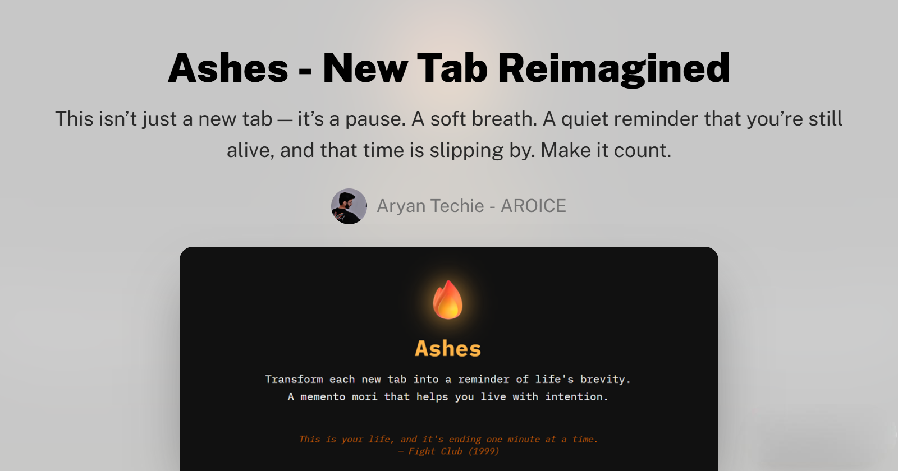

  

<h1 align="center"><strong>ASHES</strong></h1>

<em>A memento mori for your browser tabs.</em>

  
  
  

   
   
  
  

---

<!-- banner -->
 

  
   
  <em>Your life, visualized in a glance</em>

---

## 🧠 What is ASHES?

**ASHES by AROICE™** is a browser extension that replaces your default new tab page with a live countdown of your remaining time, based on your birthdate and expected lifespan.

- 🕰️ **Memento Mori** — A persistent reminder that life is finite, and every second matters
- 🧘 **Intentional Browsing** — Transform mindless browsing into moments of reflection
- 🎨 **Minimalist Design** — Clean, distraction-free interface focused on what truly matters

---

## ✨ Core Features

### 📊 Time Visualization:

- **Live Countdown** — See your remaining time visualized in real time
- **Personalized Calculation** — Based on your birthdate and expected lifespan
- **Multiple Units** — View your life in years, months, days, hours, or seconds

### 🔧 Customization:

- **Light & Dark Mode** — Choose the theme that suits your preference
- **Inspirational Quotes** — Philosophical reminders from stoic thinkers
- **Privacy-Focused** — All your data stays on your device, no tracking

---

## 📥 Installation

1. **Download** from [Chrome Web Store](https://chromewebstore.google.com/detail/Ashes%20-%20New%20Tab/ldjabgmogbniabagofffdgkohdeemiim) or [Firefox Add-ons](https://addons.mozilla.org/firefox/addon/ashes-new-tab).
2. **Install** the extension to your browser.
3. **Open** a new tab to set your birthdate and preferences.

<strong>✅ That's it! Your new tabs are now transformed.</strong>

---

## 👥 Ideal For

- 🎯 People who feel like time slips through their fingers
- 💼 Knowledge workers who spend hours in browser tabs
- ⚙️ Those seeking mindfulness in their digital experience
- 🧘 Individuals looking to live with more intention

---

## 🔍 How It Works

- ⏰ **Input**: Enter your birthdate and expected lifespan (once, during setup)
- 🧮 **Calculation**: Ashes calculates your remaining time in various units
- 📊 **Display**: Every new tab shows a visual representation of your finite time
- 🧠 **Reflection**: The visualization creates a moment for intentional decision-making

---

## 📄 Releases and Changelog

Find:
- ✅ Latest builds
- 🐞 Bug Fixes
- 📈 Improvements

All under the [Releases Section](https://github.com/AROICE-HQ/ashes/releases).

---

## 🤝 Contributing

Want to improve Ashes?

💡 **Your Ideas are welcome!** File issues or feature requests [here](https://github.com/AROICE-HQ/ashes/issues).

---

## 🧭 Roadmap

- [✓] Initial Chrome & Firefox release
- [✓] Light/Dark mode support
- [✓] Stoic quote integration
- [-] Custom backgrounds 
- [-] Time visualization options
- [-] Widget customization
- [-] Advacned Lifespan Calculation

Suggest ideas → [Feedback Form](https://ashes.aroice.in/feedback/)

---

## 📜 License

Ashes is proprietary software developed by [Aryan Techie](https://aryan.aroice.in).  
Its source code is not publicly available or open-source.

By using this software, you agree not to:
- Decompile, reverse-engineer, or modify the code
- Redistribute the extension or parts of it
- Use it for commercial purposes without explicit permission

All rights reserved © 2025 AroiceHQ. See full [LICENSE](LICENSE).

---

## 💌 Support My Work

If Ashes helps you live more intentionally, consider supporting:

  
  &nbsp;
  

---

## ✍️ Author

Made with 💛 by [Aryan Techie](https://aryantechie.com) 🌐 [AROICE](https://aroice.in)

> *"This moment is real. What will you do with it?"*

---

## ❓ FAQ

  

Get answers about:
- Privacy concerns
- Browser compatibility
- Customization options

Not listed? [Ask your question here](https://ashes.aroice.in/feedback/).